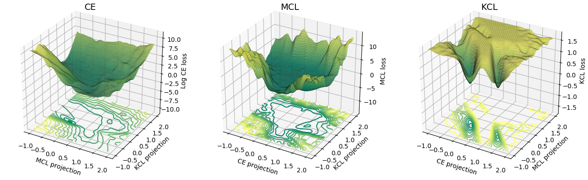

# L2C: Learning to Cluster

A clustering strategy with deep neural networks. [This blog article](https://mlatgt.blog/2018/04/29/learning-to-cluster/) provides a generic overview.

## Introduction
This repository provides the PyTorch implementation of the [transfer learning schemes (L2C)](https://arxiv.org/abs/1711.10125) and two learning criteria useful for deep clustering:
- [Meta Classification Likelihood (MCL)*](https://arxiv.org/abs/1901.00544) - News: Accepted to [ICLR2019](https://openreview.net/forum?id=SJzR2iRcK7) (Title: "Multi-class classification without multi-class labels").
- [KLD-based Contrastive Loss (KCL)](https://arxiv.org/abs/1511.06321)

<sub><sup>*It is renamed from [CCL](https://arxiv.org/abs/1806.11078)</sup></sub>

This repository covers following references:
```
@inproceedings{Hsu19_MCL,
	title =	    {Multi-class classification without multi-class labels},
	author =    {Yen-Chang Hsu, Zhaoyang Lv, Joel Schlosser, Phillip Odom, Zsolt Kira},
	booktitle = {International Conference on Learning Representations (ICLR)},
	year =      {2019},
	url =       {https://openreview.net/forum?id=SJzR2iRcK7}
}

@inproceedings{Hsu18_L2C,
	title =     {Learning to cluster in order to transfer across domains and tasks},
	author =    {Yen-Chang Hsu and Zhaoyang Lv and Zsolt Kira},
	booktitle = {International Conference on Learning Representations (ICLR)},
	year =      {2018},
	url =       {https://openreview.net/forum?id=ByRWCqvT-}
}

@inproceedings{Hsu16_KCL,
	title =	    {Neural network-based clustering using pairwise constraints},
	author =    {Yen-Chang Hsu and Zsolt Kira},
	booktitle = {ICLR workshop},
	year =      {2016},
	url =       {https://arxiv.org/abs/1511.06321}
}
```

## Preparation
This repository supports PyTorch 1.0, python 2.7, 3.6, and 3.7.

```bash
pip install -r requirements.txt
```
## Demo
### Supervised Classification/Clustering with only pairwise similarity
```bash
# A quick trial:
python demo.py  # Default Dataset:MNIST, Network:LeNet, Loss:MCL
python demo.py --loss KCL

# Lookup available options:
python demo.py -h

# For more examples:
./scripts/exp_supervised_MCL_vs_KCL.sh
```
### Unsupervised Clustering (Cross-task Transfer Learning)
```bash
# Learn the Similarity Prediction Network (SPN) with Omniglot_background and then transfer to the 20 alphabets in Omniglot_evaluation.
# Default loss is MCL with an unknown number of clusters (Set a large cluster number, i.e., k=100)
# It takes about half an hour to finish.
python demo_omniglot_transfer.py

# An example of using KCL and set k=gt_#cluster
python demo_omniglot_transfer.py --loss KCL --num_cluster -1

# Lookup available options:
python demo_omniglot_transfer.py -h

# Other examples:
./scripts/exp_unsupervised_transfer_Omniglot.sh
```
#### Notes

- The clustering results are highly dependent on the performance of the Similarity Prediction Network (SPN). For making a fair comparison, the SPN must be kept the same. Our script trains an SPN with random initialization and random data sampling. Once the SPN model is trained, the script will reuse the saved SPN and avoid training a new one. 
- The table below presents the clustering performance with the reference SPN [[download]](https://drive.google.com/file/d/1b-TU3lT1GOaMV8Z4DehFAGyOkHJayLF1/view?usp=sharing). Put the model file into /outputs folder and run demo_omniglot_transfer.py directly to generate the "MCL(k=100)" column.
- The performance metric is clustering accuracy (for details, please see [L2C](https://arxiv.org/abs/1711.10125) paper). Each value in the table is the average of 3 clustering runs. This repository reuses most of the utilities in PyTorch and is different from the Lua-based implementation used in the reference papers. The result (the row with "--Average--") shows the same trend as the papers, but the absolute values have a mild difference. The MCL results here are better than [the paper](https://arxiv.org/abs/1901.00544).

Dataset | gt #class | KCL (k=100) | MCL (k=100) | KCL (k=gt) | MCL (k=gt)
--- | :---: | :---: | :---: | :---: | :---:
Angelic                        |20|73.2%|82.2%|89.0%|91.7%
Atemayar_Qelisayer             |26|73.3%|89.2%|82.5%|86.0%
Atlantean                      |26|65.5%|83.3%|89.4%|93.5%
Aurek_Besh                     |26|88.4%|92.8%|91.5%|92.4%
Avesta                         |26|79.0%|85.8%|85.4%|86.1%
Ge_ez                          |26|77.1%|84.0%|85.4%|86.6%
Glagolitic                     |45|83.9%|85.3%|84.9%|87.4%
Gurmukhi                       |45|78.8%|78.7%|77.0%|78.0%
Kannada                        |41|64.6%|81.1%|73.3%|81.2%
Keble                          |26|91.4%|95.1%|94.7%|94.3%
Malayalam                      |47|73.5%|75.0%|72.7%|73.0%
Manipuri                       |40|82.8%|81.2%|85.8%|81.5%
Mongolian                      |30|84.7%|89.0%|88.3%|90.2%
Old_Church_Slavonic_Cyrillic   |45|89.9%|90.7%|88.7%|89.8%
Oriya                          |46|56.5%|73.4%|63.2%|75.3%
Sylheti                        |28|61.8%|68.2%|69.8%|80.6%
Syriac_Serto                   |23|72.1%|82.0%|85.8%|89.8%
Tengwar                        |25|67.7%|76.4%|82.5%|85.5%
Tibetan                        |42|81.8%|80.2%|84.3%|81.9%
ULOG                           |26|53.3%|77.1%|73.0%|89.1%
--Average--                    |  |75.0%|82.5%|82.4%|85.7%

### Compare MCL and KCL

The loss surface of MCL is more similar to the cross-entropy (CE) than KCL. Empirically, MCL converged faster than KCL. For details, please refer to the [ICLR paper](https://openreview.net/forum?id=SJzR2iRcK7).

<a href="https://openreview.net/pdf?id=SJzR2iRcK7"></a>

## Related Applications
### Lane detection for autonomous driving / Instance segmentation
```
@article{Hsu18_InsSeg,
	title =     {Learning to Cluster for Proposal-Free Instance Segmentation},
	author =    {Yen-Chang Hsu, Zheng Xu, Zsolt Kira, Jiawei Huang},
	booktitle = {accepted to the International Joint Conference on Neural Networks (IJCNN)},
	year =      {2018},
	url =       {https://arxiv.org/abs/1803.06459}
}
```

### Acknowledgments
This work was supported by the National Science Foundation and National Robotics Initiative (grant # IIS-1426998) and DARPA’s Lifelong Learning Machines (L2M) program, under Cooperative Agreement HR0011-18-2-001.
